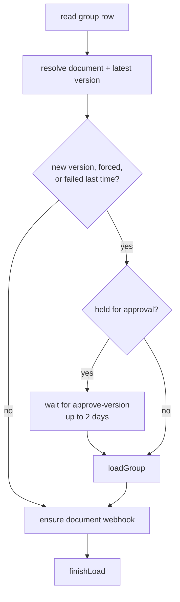

# Loading

## Purpose

A library is a set of groups, each pinned to a version of one Onshape document,
whose tabs are its insertables. Loading reads a document's latest version from
Onshape and writes everything the app shows about it: the group, each
insertable's metadata, configurations and records, thumbnails, build issues, and
the library's search index.

Every load is one group's document, run as a Cloudflare Workflow so it can take
minutes, survive retries, and resume where it stopped.

## Code map

| Path                                                            | Role                                                                 |
| --------------------------------------------------------------- | -------------------------------------------------------------------- |
| `src/backend/features/load/jobs.ts`                             | `requestLoads`, `finishLoad`, approval; one load per group at a time |
| `src/backend/features/load/workflows.ts`                        | `LoadDocumentWorkflow`: resolve the version, skip or load, webhook   |
| `src/backend/features/load/load-group.ts`                       | `loadGroup`: contents, which tabs to load, save, cleanup             |
| `src/backend/features/load/load-insertable.ts`                  | `loadInsertable`: probe one tab, its thumbnail, save its row         |
| `src/backend/features/load/context.ts`                          | `LoadContext`, limiters, `getOnshapeApiFromContext`                  |
| `src/backend/features/load/steps.ts`                            | Retry policies for Onshape steps and thumbnail steps                 |
| `src/backend/features/load/flag.ts`                             | `flagFailedLoads`, for loads that died without saying so             |
| `src/backend/features/load/routes.ts`                           | Reload and version-approval endpoints                                |
| `src/backend/features/load/parse-*.ts`                          | Onshape responses to what we store                                   |
| `src/backend/features/library/groups/routes.ts`                 | Adding a document (shell group + load) and deleting a group          |
| `src/backend/features/webhooks/`                                | The per-document webhook that loads new versions                     |
| `src/backend/features/push/`                                    | Pushes job status and library changes to open clients                |
| `src/frontend/features/library/components/reload-button.tsx`    | **Reload** (outdated) and the owner's **Reload all**                 |
| `src/frontend/features/library/components/version-approval.tsx` | **Approve new versions** and held versions                           |

## Storage

**D1**

- `load_jobs` — one row per group with a load in flight: its workflow
  `instance_id`, `started_at`, `force_reload`, `awaiting_approval`.
- `groups`, `insertables`, `configurations` — what a load writes.
  `groups.version_id` is the version loaded; a shell group holds
  `PLACEHOLDER_VERSION_ID` until its first load.
- `libraries.cache_version` — bumped by every load that wrote; every library
  response is cached under it.
- `libraries.approve_versions` — hold webhook loads for an admin.
- `onshape_webhooks` — one row per document: its webhook id and delivery token.

**R2**: `search-index/` — each library's serialized search index, rebuilt by
every load that wrote. Thumbnails are in [thumbnails.md](./thumbnails.md).

**KV**: `admin-session:` — sessions a load with no requester can borrow; see
[auth.md](./auth.md).

## Flows

### Starting loads

Three things call `requestLoads`, each with one request per group:

- **Adding a document** writes a shell group first, so a failed first load still
  leaves something to retry or delete, then loads it.
- **Reload** (admin): every group of the library; each load skips itself when
  its version is unchanged and it has no failure. **Reload all** (owner) forces
  every group, which spends a lot of the Onshape allocation.
- **A webhook** for a new version loads every group of that document, holding
  for approval when the library asks for it.

`requestLoads`:

1. Reads the groups' `load_jobs` rows and clears dead ones (an instance that
   finished or never started within a minute), flagging those groups
   `LOAD_FAILED`.
2. Terminates any load still running for a group: the new load reads the latest
   version itself. A forced load replaced by a plain one stays forced.
3. Writes the rows and creates every instance at once, in batches of 100. Loads
   are independent, so they run concurrently.
4. Pushes the library's job status.

### One load

`loadGroup`:

1. Syncs the version's thumbnail workspace.
2. Reads the document's contents and the group's stored insertables.
3. Selects tabs to load: new ones, changed ones (microversion differs), ones
   whose last load failed, or all when forced. Removed and reordered tabs are
   computed from the same lists.
4. Loads each selected tab (`loadInsertable`) in parallel under the load limiter
   (`LOAD_CONCURRENCY`, 15). A tab that fails is recorded and the rest carry on.
5. Stores the group's thumbnail, then saves the group in one step: its fields,
   removals, new order, and `INSERTABLES_FAILED` if any tab failed.
6. Deletes stale thumbnails, and stale thumbnail workspaces when nothing
   failed. Neither is fatal.

`loadInsertable`: probes the tab under the limiter (configuration, parts, fasten
info, vendors, and a record per indexed combination), fetches its thumbnail
under the thumbnail limiter, runs the insertable checks, and saves the row.

`finishLoad` always runs, success or not: when anything was written it rebuilds
the search index, then bumps the library version and pushes; then it deletes the
`load_jobs` row **only if it still holds this instance**, since a replacement
owns it otherwise.

### Whose session a load uses

A load calls Onshape as the person who asked, while their session works. A
webhook's load has nobody, and a session can expire mid-load, so
`getOnshapeApiFromContext` falls back to the owner's saved session, then a team
admin's, then (in dev) the access-level override's. No session at all fails
the step.

### Webhooks

Each load ends by making sure Onshape has the document's webhook for
`onshape.model.lifecycle.createversion` (`ensureWebhook`). It checks the stored
webhook still exists and registers a new one if not: Onshape cancels a webhook
whose registration check fails, and deactivates one whose deliveries error,
without telling us. The delivery url is on `APP_URL` and carries a random token that identifies the
row; the route answers 200 at once and does the work after, so a slow load never
costs the webhook. Deleting the last group of a document removes its webhook.

### Version approval

With **Approve new versions** on, a webhook's load of a new version marks its
row `awaiting_approval` and waits on the workflow event `approve-version` for up
to two days, then loads anyway. **Approve** sends the event to every held load;
turning approval off does too. An admin's reload replaces a held load with one
that doesn't wait.

## Invariants

- At most one load per group runs; a newer request replaces the running one.
- A load that wrote anything rebuilds the search index **before** bumping the
  library version, since the bump makes the old index url immutable.
- Only the load holding a group's `load_jobs` row releases it.
- A failure writes no microversion, so a failed tab or group is always retried
  by the next plain reload (`LOAD_FAILED`, `INSERTABLES_FAILED`).
- Steps are deterministic on retry: anything random (new insertable ids) is
  generated inside a step so the persisted result is reused.
- A load reads Onshape as its requester first, and borrows an admin's session
  only when there is none.

## Failure and recovery

| Failure                                     | Result                                                 | Recovery                                                       |
| ------------------------------------------- | ------------------------------------------------------ | -------------------------------------------------------------- |
| An Onshape step fails                       | Retried with backoff, honoring `Retry-After`           | Automatic; exhausted, the group or tab is flagged              |
| A tab fails                                 | `LOAD_FAILED` on it, `INSERTABLES_FAILED` on the group | **Reload**                                                     |
| The workflow crashes                        | Row left behind                                        | Next job-status read or request clears it, flags `LOAD_FAILED` |
| Webhook cancelled or deactivated by Onshape | No automatic loads                                     | Next load of the document registers it again                   |
| No session to borrow                        | Webhook loads fail                                     | Owner or a team admin opens the app                            |

## Decisions

- **One workflow per group, not per library.** Groups are independent, so a
  failure or a slow document holds up nothing else, and a reload is just many
  loads started at once.
- **Replace rather than queue.** A newer request always wants the latest
  version, which a fresh load reads anyway.
- **Job rows in D1, not KV.** Concurrent KV writes lose updates.
- **Loads skip unchanged versions.** Reloading spends the Onshape allocation;
  only the owner can force it.

_Last reviewed: 2026-09-27_
